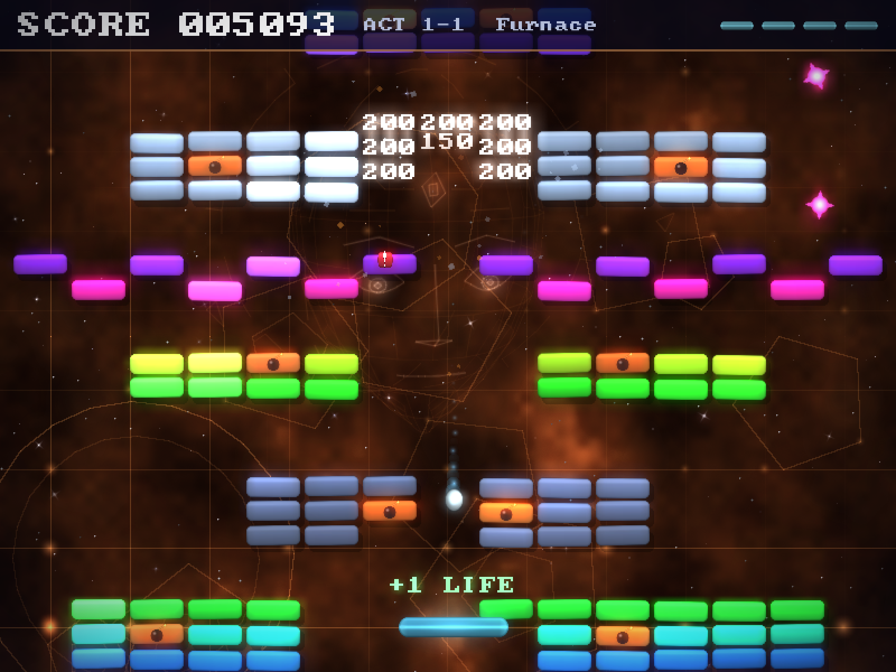

# BREAKUP — a neon arcade roguelite

A brick-breaker played as a roguelite, written in C with SDL3. Every game is a
run: four acts of hand-designed levels drawn in a new order each time, a perk
to take after every level, a boss at the end of every act and a choice after
each one — cash out, or go deeper for more. All graphics
are generated procedurally at startup (no image assets), and every sound effect
and jingle is synthesized in code by a small built-in chiptune engine. The music
is nineteen looping tracks from Abstraction's public-domain chiptune album
*Three Red Hearts* — a menu theme, four per world which the levels in it walk
through, and two boss themes the seven fights share — embedded in the binary
rather than shipped beside it. That is every distinct song in the pack. See
[NOTICE.md](NOTICE.md).



## Features

- **A run is the game** — four acts, one per themed world (Cyan Dawn, Emerald
  Drift, Ember Fields, Violet Void), each three levels and a boss. The levels
  are drawn from that world's pool in a new order every time and, from the
  second act on, often under a **mutator** (mirrored, armored, brittle, gold
  rush, swarm, surge). The fourth act ends with The Sovereign, and beating it
  wins the run — or carries on into endless acts drawn from the whole game.
  See [How a run works](#how-a-run-works).
- **The Sovereign speaks** — the being at the end of the fourth act built
  every world the run passes through, and it has something to say about each
  one. It is a face drawn in glowing 3D vector lines, with a halo turning
  behind it, that drifts over a tunnel of them, turns towards what it is
  writing and writes it a letter at a time with a beam from the eye in its
  forehead. Its voice is five sung vowels synthesized at startup, one per
  syllable, pitched from the word being said — the melody of speech with
  nothing in it to understand. It opens every run (the whole story the first
  time, a line of greeting after that — it counts your attempts), comes in
  between every two stages with a line about what is next over a map of the
  run, names each boss and the one thing worth knowing about it, reacts to
  the mutator, the curse just taken and the warden just beaten, comes apart
  when its core does, and has the last word over a run that dies or cashes
  out. The further a run gets the more of its thoughts it has lost, and the
  worse its face holds together. SPACE turns a page, ESC skips the scene, and
  OPTIONS > STORY switches all of it off.

  It is not only between the levels. It writes the title of the game when it
  starts, and says it. It looms over the menu with its eyes on whatever the
  cursor is on — and minds when that is QUIT. It hangs faint in the back of
  every ordinary level watching the ball, flinches when a crystal breaks and
  enjoys a life lost. On the last fight it is the core itself, and every hit
  on the crystal is a hit on its face, until the face comes apart with it.
  Its stylus is the cursor in every menu, and its scan line is the way one
  screen turns into the next.
- **Perks** — after every level, one of three to keep for the rest of the run:
  fourteen of them, each a rule that hooks into something the game already
  does, so they stack into combinations. Six are earned by playing: beat The
  Gyre, detonate eight explosive bricks in one level, and so on. The PERKS page
  says what each one takes.
- **Cash out or go deeper** — after every boss. Going deeper raises the score
  multiplier and adds a curse that stays for the rest of the run, and half of
  what you score from there is lost if you die before the next chance to cash
  out.
- **Daily run** — one seed per date, the same run for everybody, with its own
  best score. Entirely offline: the seed is the date.
- **20 hand-designed levels and 7 bosses**, from single-screen classics to
  tall scrolling towers. Levels are plain text files — easy to edit and mod.
- **7 brick types**: basic, durable (2 hits), tough (3 hits), indestructible
  steel, explosive (chain reactions!), gold bonus bricks, and the crystal —
  destroy all crystals to clear a level.
- **4 enemy types**: drifters that wander the field, divers that hunt your
  paddle, splitters that break into two minis, and saucers that shoot back.
- **7 boss fights**: two to a tier, so each act's is one of a pair, and The
  Sovereign alone at the end of the fourth. A boss is the game's own
  vocabulary turned on the player: a crystal — the thing every other level asks
  you to break — behind a ring of armour plates that look like bricks and orbit
  it. A plate takes the hit a brick would and gives nothing back; the crystal
  behind them is the only thing that counts, and the only way to it is a gap.
  Land enough hits and the ring slams shut again, faster, throwing out anything
  caught inside it. Three phases each, and the arena goes up with the boss.

  No two are the same fight. **The Warden** turns one slow ring and shoots what
  you can see coming. **The Gyre** spins hard the other way and its plates take
  three hits. **The Brood** barely has a ring and fills the field with enemies
  instead. **The Binary** puts a second ring inside the first, turning against
  it, so a gap is two gaps that have to line up. **The Pulsar** breathes its
  ring open and shut and fires in every direction at once. **The Stalker** comes
  down the screen after you. **The Sovereign** does all of it.
- **9 power-ups**: Expand, Laser, Catch, Extra Life, Multiball, Slow,
  Fireball, Barrier — and Shrink, which is a gamble rather than a plain
  punishment: while the paddle is small, the combo multiplier is one higher.
- **Combo scoring** — chain brick hits without touching the paddle for up to
  a 5× multiplier. Each unbroken link breaks a semitone higher than the one
  before it, so a long chain climbs a scale rather than repeating a noise, and
  every step of the multiplier announces itself. Explosions pay out at the
  multiplier the ball built, so a chain reaction is worth setting up, and an
  enemy caught in a blast drops a capsule.
- **GIF clips** — press **G** to save the last eight seconds of play as a
  looping GIF in `Pictures/Breakup`. The game keeps the last eight seconds at
  half size all the time, so the moment worth keeping is already recorded by
  the time you reach for the key. (Not in the browser build.)
- **Juice**: a bloom pass over the whole field, hit stop on the heavy impacts,
  a camera that shakes in both axes, rolls and leans into a hit, debris thrown
  along the line of the blow, floating score popups, ball trails, and animated
  backgrounds with parallax starfields.
- **Full game flow**: animated intro, main menu, the perk collection, options
  (music/SFX volume, fullscreen, story), a table of the best runs and today's daily,
  pause menu. Unlocked perks, scores and settings persist between sessions.

## Controls

| Input          | Action                                          |
| -------------- | ----------------------------------------------- |
| Mouse / ← →    | Move the paddle                                 |
| Space / Click  | Launch ball, shoot lasers, release caught balls |
| Esc / P        | Pause                                           |
| G              | Save the last 8 seconds as a GIF                |
| 1 2 3          | Take a perk between levels                      |
| Space / Enter  | Write out / turn a page of the Sovereign's      |
| Esc            | Skip the Sovereign's scene                      |
| F              | Toggle fullscreen                               |
| Arrows + Enter | Navigate menus                                  |

## Building

Requires a C17 compiler (`clang` on macOS, `cc` elsewhere), `pkg-config`, and
SDL3 with SDL3_ttf and SDL3_mixer (`brew install sdl3 sdl3_ttf sdl3_mixer` on
macOS). The shipped builds carry their own SDL — see [Releases](#releases).

```sh
make release   # optimized build -> ./breakup
make debug     # debug build     -> ./breakup_dbg
make run       # build debug and run
make test      # build and run the test suite -> ./breakup_test
make sanitize  # ASan + UBSan build          -> ./breakup_asan
make clean     # build output only — dist/ is left alone
make distclean # clean, plus the packaged releases in dist/
```

### Tests

`make test` builds every source file except `src/main.c` against a runner of
its own in [`tests/`](tests/) and runs it. It brings up no window, no renderer
and no mixer, so it needs neither a screen nor a sound card and finishes in
about a second.

What it covers is the part of a game like this one that *can* be checked
without a display: the arithmetic in `src/globals.h` (including what a clamp
does with a NaN, which is what stands between a hand-edited save file and
undefined behaviour), the level files as they actually ship — every level
named, every one of them finishable, the world and music tables landing inside
their arrays — the high-score table, and the run: its random number
generator against the PCG reference output, a run as a function of its seed
(the same levels, mutators and offers every time, from the right pools), what
going deeper costs, what winning pays and what unlocks each perk. Every line
the Sovereign can say is held to the size of its page and to the glyphs it is
drawn from, and so is every page its scenes can put together, for every act,
stage, boss, mutator, curse and ending. The GIF writer is checked by
decoding what it writes with an LZW decoder of the test's own. It runs with the
save file switched off, so it cannot touch your own progress.

Everything else is still checked by playing it, and by
[`BREAKUP_AUTOPLAY`](#development-helpers) under a sanitizer: `make sanitize`
builds `./breakup_asan` with AddressSanitizer and UndefinedBehaviorSanitizer on
the debug flags at `-O1`, and `BREAKUP_AUTOPLAY=1 ./breakup_asan` plays the
game against them.

All assets (font, level files and the nineteen music tracks) are embedded into
the binary by `embed_assets.sh` during the build, so the executable is
self-contained — `src/assets.c` is the single file that carries them, and
`src/embedded_assets.h` is generated, not checked in. The music is the bulk of
it: about 18 MB of Ogg Vorbis, which is most of the binary's size and a few
seconds of the build. SDL_mixer decodes it from the executable's own read-only
data while it plays, so none of it is copied or decoded up front.

Builds are parallel-safe (`make -j`) and track header dependencies, so editing a
header or a level file rebuilds what depends on it — and a build with nothing to
do does nothing, including regenerating that 113 MB header.

## Releases

`make release` links Homebrew's SDL3, which is arm64-only and built for this
machine's macOS — fine to develop against, useless to anybody else. Every
shipped build is a separate script in `packaging/`, and each one carries its own
copy of SDL so the player installs nothing.

| Target  | Command      | Output                                         | Where it can be built                 |
| ------- | ------------ | ---------------------------------------------- | ------------------------------------- |
| macOS   | `make mac`   | `Breakup-1.0.0-macos.zip`, `Breakup-1.0.0.dmg` | a Mac with a Developer ID certificate |
| Windows | `make win`   | `Breakup-1.0.0-windows-x64.zip`                | any Unix with mingw-w64               |
| Linux   | `make linux` | `Breakup-1.0.0-linux-x86_64.tar.gz`            | Linux only                            |
| Web     | `make web`   | `Breakup-1.0.0-web.zip`                        | anywhere emscripten runs              |

Everything lands in `dist/`. Two files own the numbers all four scripts read:
`src/version.h` has the version, the app name and the save directory, and
`packaging/sdl3_pins.sh` pins the SDL versions along with the sha256 of every
archive any of them downloads. Moving a version means editing one line in one of
those rather than a line in each of the four.

Neither the Windows nor the Linux payload needs a Mac:
[`.github/workflows/payloads.yml`](.github/workflows/payloads.yml) builds both on
GitHub's runners and attaches them to the run. It starts on nothing but the
button on the Actions tab.

### macOS

```sh
make mac       # -> dist/Breakup-1.0.0-macos.zip and dist/Breakup-1.0.0.dmg
```

It builds a universal (arm64 + x86_64, macOS 11+) binary against the official
SDL3, SDL3_ttf and SDL3_mixer frameworks from libsdl.org, copied into
`Contents/Frameworks`. It then signs the bundle with Developer ID under the
hardened runtime, sends it to Apple's notary service, and staples the ticket into
both the .app and the .dmg. Without that last part macOS tells whoever you send
it to that the app cannot be checked for malicious software and refuses to open
it.

Two things are needed once, on the machine that cuts releases:

- a **Developer ID Application** certificate in the keychain (a paid Apple
  Developer Program membership; it is _not_ the "Apple Development"
  certificate Xcode makes for running on your own devices)
- notarization credentials, stored under a keychain profile:

  ```sh
  xcrun notarytool store-credentials breakout-notary \
      --apple-id <your-apple-id> --team-id <TEAMID> \
      --password <app-specific-password from appleid.apple.com>
  ```

`make mac` fails with instructions if either is missing, rather than quietly
producing a build Gatekeeper will reject.

### Windows

```sh
make win       # -> dist/Breakup-1.0.0-windows-x64.zip
```

Cross-built with mingw-w64 (`brew install mingw-w64`, or `apt install
mingw-w64`), so it runs on the same Mac that cuts the macOS release. There is no
Windows anywhere in `src/` — every include is SDL or the C standard library — so
what a Windows build needs is a compiler that targets Windows rather than a
second project file to keep in step with the makefile.

The zip unpacks to one folder holding `breakup.exe` and the three SDL DLLs it
was linked against. Nothing else: freetype and harfbuzz live inside
`SDL3_ttf.dll`, and `-static-libgcc` keeps the compiler's own runtime out, so the
only thing the player's machine supplies is Windows itself (10 or newer, x64).

The exe is **not** signed with an Authenticode certificate, so Windows will warn
that the publisher is unknown. The payload's `README.txt` says so and points at
this repository.

### Linux

```sh
make linux     # -> dist/Breakup-1.0.0-linux-x86_64.tar.gz
```

The one archive that cannot be cut on a Mac: its SDL is compiled against the
userland it will run on, so the script refuses to start anywhere but Linux. It
builds SDL3, SDL3_ttf and SDL3_mixer from the pinned release tags into
`build/sdl3-linux` (once per pin — it is cached there), then links the game with
an rpath of `$ORIGIN/lib` so the payload finds its own copies wherever it is
unpacked.

SDL_ttf is built with vendored freetype and harfbuzz off, and SDL_mixer with
every decoder that needs an external library off — the game renders Latin text,
synthesizes its sound effects into raw PCM, and its music is Ogg Vorbis, which
SDL_mixer decodes with the built-in stb_vorbis and no external library. So none
of that costs it anything, and the payload stays at three `.so` files that need
nothing installed.

Building SDL needs cmake, git and the X11, Wayland and audio development
headers. `packaging/build_linux.sh` checks for the headers first and names the
missing Debian package in one line, rather than leaving cmake to fail on one
extension at a time. The workflow's `linux` job installs exactly that list.

The glibc floor of the archive is whichever machine linked it — Ubuntu 24.04's
2.39 when it comes out of the workflow, which is why the runner there is pinned
rather than `ubuntu-latest`.

### Web

```sh
make web       # -> dist/Breakup-1.0.0-web.zip
```

The one payload that is not a download: itch.io serves an HTML5 build from an
iframe on the game's own page, and most of that site is played that way. Needs
[emsdk](https://emscripten.org/docs/getting_started/downloads.html) (emscripten
4.0 or newer) and cmake; it cross-builds anywhere those run, the Mac included.
Upload the zip, tick **This file will be played in the browser**, and set the
viewport to 800×600.

`index.html` sits at the root of that archive rather than inside a named folder,
which is the opposite of what the other three do and is itch.io's rule, not a
choice. The page is [`packaging/web_shell.html`](packaging/web_shell.html): it
downloads the `.wasm` itself so the progress bar means something, and holds
`main` back behind a PLAY button so the first frame drawn is also the first frame
allowed to make a sound — a browser throws audio away until the page has been
clicked on.

SDL3, SDL3_ttf and SDL3_mixer are built from the pinned release tags into
`build/sdl3-web` (once per pin), statically, with the same decoders and
dependencies switched off as the Linux payload. One cmake flag is the reason they
are built from source at all: `SDL_EMSCRIPTEN_PERSISTENT_PATH` makes SDL mount the
browser's IndexedDB over `SDL_GetPrefPath()` and wait for it before `main` runs,
which is the whole of whether a player's settings, unlocked perks and high scores
survive closing the tab. `src/lib/save.c` is untouched by any of it.

Two things the browser build does differently in the source. `main()` hands the
loop to `emscripten_set_main_loop`, which calls one frame per repaint instead of
spinning in a `while` — a page that spins in C never yields to the event loop
that draws it, so the canvas stays blank and the tab stops answering. And
`BREAKUP_OFFERS_QUIT` is nought, so the menu has no QUIT row: there is no process
to close, and a cancelled loop leaves a frozen canvas that reads as a crash. The
tab is the way out and the player already has it. That one is a `#define` in
`globals.h` rather than an `#ifdef` at each site, because the row is also a count
— the arrow keys, the mouse hit tests and the texture cleanup all walk it.

The archive is about 20 MB, most of which is the soundtrack: the web payload
carries the same embedded assets as the other three rather than a stripped-down
set.

## The store page

```sh
make press     # -> dist/press/ (screenshots, cover, GIFs, wallpaper, MANIFEST.txt)
```

There is no art in this repository to crop for a store page: every pixel is drawn
at runtime, so the only place a picture of this game exists is the back buffer of
a running process. [`tools/press_kit.sh`](tools/press_kit.sh) photographs it
there — nineteen stills at native size and at 2x, four GIFs, the itch.io cover and
a wallpaper — which means the pictures can be _rebuilt_ after a change to the art
instead of being re-photographed by hand and quietly left a version behind.

The game plays itself for it: `BREAKUP_AUTOPLAY` steers the paddle at the ball,
so the captures are real play rather than an idling background. The picture at the
top of this file is one of them — `make press` refreshes it too, so it cannot
quietly end up a version behind the game. Everything else the store page needs,
and what to do with it, is in [`itch/`](itch/README.md).

## How a run works

Four acts of four stages, each three levels and a boss. The first act draws
from the first world's levels and from The Warden and The Gyre, the second from
the second world and The Brood and The Binary, the third from the third world
and The Pulsar and The Stalker, and the fourth from the last world and ends with
The Sovereign. A level is not repeated until its pool runs dry, and the ball's
launch speed follows the stage, not the file the stage drew.

Beating The Sovereign wins the run and pays a victory bonus of 10,000 at the
run's multiplier. The choice after it is FINISH — the run ends there, a win — or
ENDLESS: acts drawn from the whole game, with a boss from the back half of it at
the end of each, for as long as you last. A cash-out anywhere in the endless
acts still counts as a win.

The table of best runs keeps the score and the act each run reached. It is new
with runs: the high scores of the 1.0 campaign were levels of a different game,
and a save from then keeps its settings and starts the table empty.

Everything that shapes a run — the levels, the mutators, the perks on offer and
the curses — comes from a generator of the game's own (PCG32, in
[`src/run/rng.c`](src/run/rng.c)) rather than from `rand()`, which is a
different algorithm on each of the four platforms. That is what makes a daily
run the same run everywhere. A daily also offers every perk, unlocked or not, so
that two players of one date are playing the same game.

Going deeper raises the score multiplier by 0.5 and adds one curse — OVERDRIVE
(faster balls), HARDENED (basic bricks take two hits), DROUGHT (fewer capsules),
NARROW (a shorter paddle) or HUNTED (enemies respawn faster) — and it marks a
checkpoint: die, or abandon the run, before the next boss and half of what was
scored since is lost. Cashing out, or finishing after The Sovereign, keeps it
all.

| Perk           | What it does                                                  | Unlocked by                           |
| -------------- | ------------------------------------------------------------- | ------------------------------------- |
| Gold Fever     | Gold bricks always drop a capsule                             | —                                     |
| Magnet         | Falling capsules drift towards the paddle                     | —                                     |
| Lucky          | Bricks drop capsules 50% more often                           | —                                     |
| Overtime       | Every power-up lasts 50% longer                               | —                                     |
| Safety Net     | The first ball lost in each level bounces back                | —                                     |
| Soft Hands     | A ball caught by the Catch paddle keeps the combo             | —                                     |
| Crystal Blast  | Crystals explode when they break                              | —                                     |
| Tracer Rounds  | Laser hits score at the combo multiplier and build it         | —                                     |
| Chain Reaction | Every brick an explosion breaks adds one to the combo         | Detonating 8 explosive bricks in a level |
| Hunter         | Every enemy killed adds three to the combo                    | Killing 10 enemies in one level       |
| Split Shot     | Every step up the combo launches an extra ball                | Reaching a combo of ×5                |
| Glass Cannon   | The combo goes to ×8 instead of ×5, but balls are 15% faster  | Beating The Gyre                      |
| Inferno        | While fireball is lit, explosions are 75% wider               | Beating The Pulsar                    |
| Meltdown       | Fireball melts steel bricks                                   | Beating The Sovereign                 |
| +1 Life        | One more life, on the spot                                    | —                                     |

A new perk goes at the end of the `Perk` enum in
[`src/run/perks.h`](src/run/perks.h), before `PERK_EXTRA_LIFE`: the save keeps
the unlocked ones as a bitmask indexed by it.

## Level format

Levels live in `assets/levels/levelNN.txt`. The first `#` line names the
level; every other line is a row of 15 cells:

```
_ empty   B basic   D durable   T tough    S steel (indestructible)
X explosive   G gold   F crystal (the objective)
E drifter   V diver   W splitter   U saucer   (enemy spawn points)
```

A `#boss N` line anywhere in the file makes the level a boss fight instead —
`N` is 1 to 7, and `bossDefs[]` in [`src/boss/boss.c`](src/boss/boss.c) is the
whole of what that picks: how many rings turn and which way, how the thing
moves, what it shoots, whether it sends anything after you. A new boss is an
entry in that table and a level file, not code.

The bricks of a boss level are the arena rather than the objective: the level
ends when the boss does, and whatever is still standing goes up with it. Keep
them to the bottom two rows and keep them breakable — the top of the pattern is
where the boss lives, and anything indestructible in the middle of the field
becomes a ceiling a ball can rally off forever without ever reaching it.

The worlds are the levels that are *not* boss fights, five at a time, so a boss
belongs to the world it interrupts and inserting one does not renumber a world.

Add a `level28.txt` and runs start drawing it: it joins the pool of the world
it lands in, or the last world's once the four are full.

## Development helpers

Environment variables understood by the binary (useful for testing, and what
`make press` is built out of):

- `BREAKUP_LEVEL=N` — start a run on level N instead of the level it drew
- `BREAKUP_STATE=intro|menu|playing|gameover|win` — jump to a screen
  (`gameover` and `win` show the run-over screen with a made-up result)
- `BREAKUP_AUTOPLAY=1` — the paddle tracks the ball automatically
- `BREAKUP_SHOT=frame:path.bmp` — save a screenshot at a frame, then exit
- `BREAKUP_SHOT_FRAMES=N` — write N frames from there on, `path-0000.bmp` up
- `BREAKUP_SHOT_STEP=K` — keep every K-th frame of that burst
- `BREAKUP_KEYS=frame:scancode,...` — inject key presses (44 is Space, 41 Esc)
- `BREAKUP_SCORE=N` — start with N points
- `BREAKUP_SEED=N` — seed the RNG instead of the clock
- `BREAKUP_RUN=N` — start a run with seed N
- `BREAKUP_RUN_STAGE=K` — …at its K-th stage, having gone deeper at each boss
- `BREAKUP_OVERLAY=1` — …with the perk draft (or the cash-out) already open
- `BREAKUP_RUN_PERKS=M` — …holding every perk in the bitmask M (`0x3fff` is all
  fourteen, in the order of the table under
  [How a run works](#how-a-run-works))
- `BREAKUP_CLIP_DIR=path/` — write G's clips there instead of to Pictures
- `BREAKUP_STORY=prologue|interlude|finale|epilogue` — open on that scene of
  the Sovereign's: the first three over a run (with `BREAKUP_RUN_STAGE` for
  the stage it is about), the epilogue over `BREAKUP_STATE=gameover`. Without
  it, a run a helper starts has no prologue, so a capture of a level is a
  capture of the level

`BREAKUP_SHOT` makes the whole run a **scripted** one, and that is three things
beyond writing a file. It reads and writes no save, so it plays with the settings
the game ships with rather than the ones on this machine — which matters most for
the fullscreen flag, because that is what decides the size the captured frame
comes out at — and it cannot overwrite anybody's progress or high scores. It
advances the world by a fixed 1/FPS step rather than by the wall clock, so a
frame number is a moment in the game and not a moment on the machine. And it
paces itself to nothing at all — no frame cap and no vsync — so a shot deep into
a level costs a fraction of the time that level would take to play. With
`BREAKUP_SEED` on top, two runs of one commit produce byte-identical pictures.

## Credits

The code, the levels, and every pixel and sound effect the game generates are by
Robert Libšanský. Two things on disk this project did not write:

- **Music:** nineteen tracks from *Three Red Hearts* by
  [Abstraction](https://abstractionmusic.com/) (Benjamin Burnes), released into
  the public domain under CC0 as part of his
  [Music Loop Bundle](https://tallbeard.itch.io/music-loop-bundle).
- **Font:** **PC Senior** by [codeman38](https://www.zone38.net/font/), a
  TrueType conversion of the IBM CGA 8×8 pixel face.

## License

The project is MIT — see [LICENSE](LICENSE). That covers everything here **except
the font and the music**, which are somebody else's work; see
[NOTICE.md](NOTICE.md). The music is CC0 and settles itself. The font does not —
that entry still has an open question on it that wants answering before a public
release.
